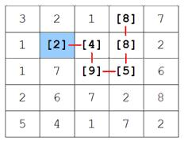

# Max Path

Archive of my Max Path Competition and Solution, circa 2004.

## Description

The Max Path challenge was proposed around Christmas time 2004 as a holiday diversion in my research centre (by Jason Brownlee and Clinton Woodward). Basically the problem was inspired by the "high path" problem on numberpuzzles.com. The max path problem is basically to find a path in an provided n-dimensional matrix that gets the highest score where each cell in the matrix has a value between 1 and 16. The competition poses three problems that differ in complexity from easy two-dimensional lattice, to a difficult five-dimensional lattice. Provided on the site is a leader board where solutions can be posted for bragging rights.

## Max Path Challenge!

All you have to do is find the highest scoring path through a grid of n dimensional cells, where each cell has a number.  Your path may start and finish anywhere, must be a fixed length and may only change in one dimension each step. (No diagonal movements!) Just add up your numbers to arrive at your score. Cells can be used more than once in the path, but the cell number is not included again.  That's all there is to it!

## Max Path Solution

Branch and bound, Java, November 2004.

The problem can be addressed with any heuristic or stochastic global search technique. I chose to address the problem with a simple branch and bound algorithm. The algorithm is simple and its heuristics are controlled entirely from a properties file.

The algorithm starts by loading in the selected problem definition (small, medium or hard) and scanning the matrix for start nodes. These nodes become the base of of each branch and bound search for a maximum scoring path. Selection of start nodes is controlled by the min.search.square.value.cutoff parameter. This is typically kept at the maximum of 16. The algorithm constructs a search graph selectively only adding those nodes that are expected to payoff. A cost is used to the current node which is simply the sum of the values to that point. A heuristic is used that estimates the payoff of exploring the path; easy.problem.estimation.value, medium.problem.estimation.value, hard.problem.estimation.value. Given that a path for a given problem has a fixed length, the heuristic simply multiplies the remaining number of nodes by the estimate value.

The algorithm also takes in a starting point best path value; easy.problem.initial.start.score, medium.problem.initial.start.score, hard.problem.initial.start.score. This is the score of the best path found thus far, and initially can be estimated or found by doing a rough first pass. Basically there is a trade-off between accuracy and speed. The higher the best path found thus far, the more pruning of paths that can be performed. This can be over estimated for a speedup. The lower the heuristic estimate the faster the algorithm will run. Values around 14-15 will run fast and provide reasonably accurate results. An estimate of 16 is guaranteed of finding the very best path, though is intractable for large problems.

Neighbours are typically added in descending order so that the most likely (beneficial) paths are evaluated first; search.potential.order.desc=true. A neighbour cut-off is also provided that allows neighbours that do not look interesting to be ignored providing further speedups; min.neighbour.sqaure.value.cutoff=0.

That is basically it for the algorithm. There are two additional useful tools when running the algorithm. The first is an initial first pass; search.firstpass=true. This approach runs the configured algorithm in fast mode, adding only a small set of neighbours of each node, essentially evaluating only the most superciliously beneficial paths. This is useful for getting a good rough initial best path score for the heuristic. The second useful tool is an incremental or iterative search mode; search.increment.mode=false. This mode simply runs the algorithm for a set number of iterations search.increment.iterations, incrementing the heuristic cell value estimate each iteration by a fixed amount search.increment.value. This is useful for long runs where the best score is increasing for each run, thus reducing the search space evaluated each run.

The implementation is basic and useful implementation of the branch and bound algorithm. Further it is side open for additional heuristic speedups.

* [maxpath1.0.zip](maxpath1.0.zip)
* [Browse Project and Code](maxpath1.0/)

## References

* [Longest path problem, Wikipedia](https://en.wikipedia.org/wiki/Longest_path_problem)
* [Jason's Max Path Competition (archived)](https://web.archive.org/web/20080721033344/http://www.ict.swin.edu.au/personal/jbrownlee/other/maxpath/index.html)
* [Max Path Challenge! (archived)](https://web.archive.org/web/20080722084656/http://www.it.swin.edu.au/centres/ciscp/challenge/)

